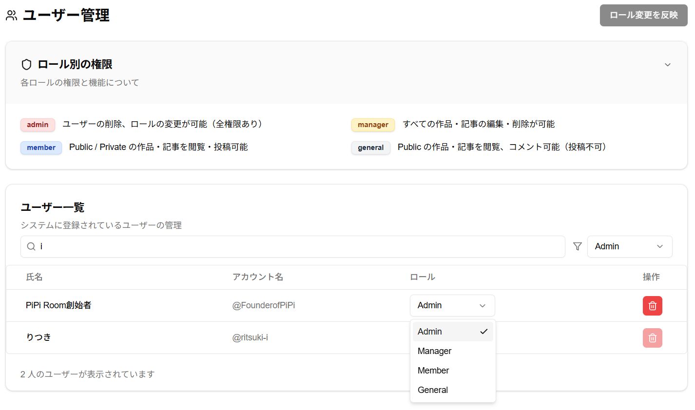

# PiPi Room

PiPi Room は、作品や記事の公開だけでなく、運用面まで含めて設計した投稿プラットフォームです。特に、**ロール管理による運用システム**と**使いやすい UI** に注力し、管理者が GUI 上でユーザ権限を更新しながら安全に運用できる構成を目指しました。

---

## 目次

- [注力ポイント](#注力ポイント)
- [ロール管理画面](#ロール管理画面)
- [概要](#概要)
- [開発背景](#開発背景)
- [機能](#機能)
- [使用技術](#使用技術)
- [アップデート内容](#アップデート内容)

---

## 注力ポイント

- **非開発者でも継続運用できること**  
  このプロダクトでは、開発者本人が卒業した後でも、外部サービスが利用可能である限り運用を継続できる構成を重視しました。コードを直接触らなくても GUI 上で必要な管理作業が進められるため、属人化しにくい運用基盤になっています。

- **GUI 上で完結するロール設定**  
  管理者はダッシュボード上で各ユーザのロールを変更でき、権限の変更を画面操作だけで反映できます。設定変更のためにデータベースを直接触る必要がない点が強みです。

- **UI / UX**  
  作品・記事の閲覧、投稿、管理までを直感的に扱えるように設計しました。ロールに応じて見える機能を整理し、必要な操作に迷いにくい導線を意識しています。

## ロール管理画面

管理画面では、ユーザ一覧の確認、ロールごとの絞り込み、各ユーザの権限変更を GUI 上で行えます。PiPi Room の運用面で最も力を入れたポイントのひとつです。

## 概要

PiPi Room は、ユーザが自身のクリエイティブな活動を作品や記事として発信できるプラットフォームです。  
各ユーザは担当ロールに応じた権限を持ち、コンテンツの作成や管理を行います。さらに、Supabase のストレージやモダンなフロントエンド／バックエンド技術を活用し、パフォーマンスとユーザビリティを両立しています。

## 開発背景

Pied Piper青山テック愛好会（現 Digitart テクノロジー愛好会）では、毎年秋に開催される青山祭において、メンバーが各々作品を制作し、来場者の方に体験していただく展示イベントを行っています。  
その際に作られた作品を保存しているプラットフォームは今まで存在しておらず、作った作品はイベント期間外で使うことができませんでした。  
「考える→作る→体験してもらう→フィードバックを得る」というサイクルを大切にしているため、イベント期間外でもアクセスできてフィードバックをもらえる環境を作ることで、より高い開発モチベーションを得られると考え、このプラットフォームを作成しました。

---

## 機能

### 主要画面

- **Top 画面**  
  ユーザのエントリーポイントとなるランディングページです。

- **Works 画面**  
  各ユーザが投稿した作品を一覧表示します。`Public` な作品は誰でも閲覧可能で、`Private` な作品は `member` 以上のユーザのみ閲覧できます。

- **Article 画面**  
  作品画面と同様の構成で記事を表示します。Markdown によるリッチなコンテンツ表現に対応しています。

- **Dashboard 画面**  
  作品／記事の投稿、編集、管理を行う専用画面です。ロールに応じて表示内容と操作可能範囲が変化します。

- **Profile 画面**  
  自分のプロフィールを設定するページです。

- **Loading 画面**  
  データ取得中にも体験が単調にならないよう、インタラクティブなローディング画面を実装しています。

### ロールと権限

- **admin**  
  全ユーザの管理、削除、ロール変更を担当します。

- **manager**  
  すべてのユーザの作品／記事を閲覧・編集でき、ラベルや使用技術の管理も可能です。

- **member**  
  作品／記事の新規投稿が可能で、`Private` なコンテンツも閲覧できます。サークル所属確認済みメンバーを想定したロールです。

- **general**  
  `Public` な作品／記事の閲覧とコメントが可能です。投稿機能は持ちません。

## 使用技術

- **フロントエンド**  
  **Next.js**

- **バックエンド**  
  **Next.js**（API ルートを通じたサーバサイド処理）

- **データベース**  
  **Supabase**（PostgreSQL ベースのリアルタイムデータ管理）

- **ORM**  
  **Drizzle ORM**（型安全なデータベース操作のために採用）

- **UI**  
  **Tailwind CSS**（ユーティリティファーストな CSS フレームワーク）

- **コンポーネントライブラリ**  
  **shadcn/ui**（高品質な UI コンポーネントでデザインの統一を実現）

- **デプロイ**  
  **Vercel**（Next.js との親和性が高く、スムーズなデプロイをサポート）

---

## アップデート内容

以下の機能が追加または改善され、順次デプロイされています。

- **Supabase Storage を用いた作品アイコンの管理**  
  作品のアイコンが Supabase Storage に保存されるようになりました。

- **関連画像の同時削除**  
  ユーザ、作品、記事の削除時に、関連する画像も自動的に削除されるよう改善されました。

- **管理者の編集・削除権限のバグ修正**  
  管理者が全ユーザ作成の作品／記事を編集・削除できない不具合を修正しました。

- **Markdown 表示による記事レンダリング**  
  記事表示時に Markdown を正しく読み込み、リッチなコンテンツ表現が可能になりました。

- **記事プレビュー画面での画像表示**  
  プレビュー画面において記事内の画像が正しく表示されるようになりました。

- **新規記事作成時の articleId 取得不具合の解消**  
  新規作成時、プレビューに遷移する際の articleId 未取得問題を修正しました。

- **公開設定（public / private）の実装**  
  コンテンツごとに公開設定を行えるようになりました。

- **作品作成時の画像保存問題の修正**  
  作品情報入力時に articleId が未設定の場合の画像保存不具合を修正しました。

- **ユーザ取得問題の解消（4/2 デプロイ済）**  
  デプロイ環境でのユーザ情報取得に関する問題を解決しました。

- **記事／作品のラベルと作成日時による並べ替え＆検索機能**  
  ラベルや作成日時でのコンテンツの並べ替え、および検索が可能となりました。

- **Alert から Toast への変更による通知改善（4/9 デプロイ済）**  
  プロフィール更新や記事更新時の通知が、従来のアラートから Toast 表示へ変更されました。

- **記事／作品へのコメント機能の実装（4/9 デプロイ済）**  
  ユーザが記事や作品に対してコメントを投稿できるようになりました。

- **Top 画面の追加（4/13 デプロイ済）**  
  全体のエントリーポイントとして Top 画面が新たに追加され、ユーザのナビゲーション性が向上しました。

---
